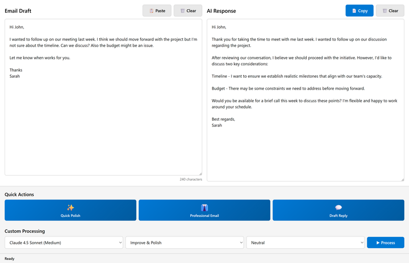
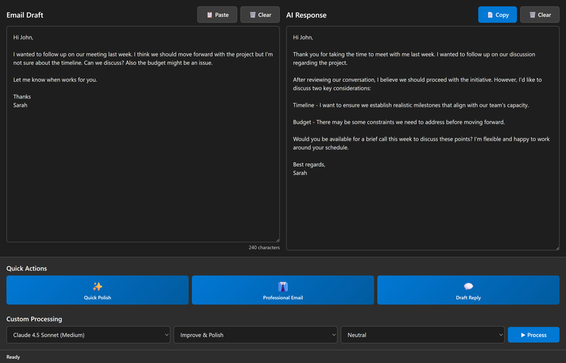
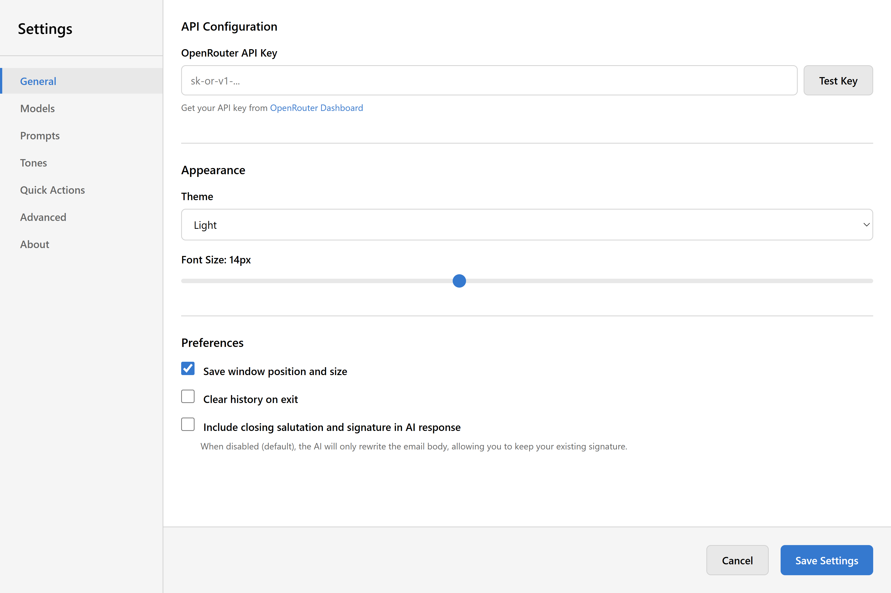

# Compose Booster

**AI-Powered Email Composition Assistant**

Compose Booster helps you write better emails faster using advanced AI models. Polish your drafts, adjust tone, fix grammar, and more—all with simple one-click actions.

---

## Screenshots

  

  <em>Main interface with AI-improved email output (Light Theme)</em>

More Screenshots

### Dark Theme

  

### Settings

  

---

## ✨ Features

### 🚀 Quick Actions
- **One-click email improvements** with customizable quick action buttons
- **Keyboard shortcuts** (Ctrl/Cmd + 1/2/3) for lightning-fast processing
- **Configurable presets** - customize your quick actions to match your workflow

### 🎯 Smart Email Processing
- **Multiple AI models** - Choose from Claude, GPT-4, Gemini, and more (text models only)
- **Flexible prompts** - Improve tone, fix grammar, shorten, expand, or create custom prompts
- **Tone control** - Switch between professional, friendly, neutral, and other tones
- **Style Profiles** - Train the AI to match your personal writing style with example emails
- **Signature handling** - Option to preserve your existing email signature

### ⚙️ Powerful Features
- **Dark mode** - Easy on the eyes with light, dark, or system theme
- **Clipboard integration** - Quick paste and copy with keyboard shortcuts
- **Output format options** - Copy as plain text, Markdown, or HTML for rich text pasting
- **Context warnings** - Alerts when input is approaching the model's context limit
- **Response regeneration** - Try Again button to get alternative responses
- **History/Undo** - Restore previous inputs with Ctrl+Z
- **Character counter** - Track your email length in real-time
- **Fully customizable** - Configure models, prompts, tones, styles, and quick actions

---

## 📦 Installation

### Download

**Windows:**
- Download `compose-booster-1.0.0-Setup.exe` from [GitHub Releases](https://github.com/lestephen/compose-booster/releases)
- Run the installer
- **Note:** You may see a Windows SmartScreen warning (this is normal for unsigned software). Click "More info" → "Run anyway"

**macOS:**
Coming soon to the App Store

**Alternative:** Download the latest release from the [Releases page](https://github.com/lestephen/compose-booster/releases)

### Requirements

- **OpenRouter API Key** - [Sign up for free at OpenRouter](https://openrouter.ai/keys)
  - OpenRouter provides access to multiple AI models through a single API
  - Pay-as-you-go pricing (typical email costs: $0.001-0.01 per email)

---

## 🚀 Getting Started

### 1. Install and Launch

Run the installer and launch Compose Booster.

### 2. Configure API Key

1. Open **Settings** (File → Settings or Ctrl/Cmd + ,)
2. Enter your **OpenRouter API key**
3. Click **Test Key** to verify
4. Click **Save Settings**

### 3. Start Composing!

**Quick Actions Method:**
1. Paste or type your email draft
2. Click one of the quick action buttons (⚡ 🎯 ✨)
3. Review the improved version
4. Copy and use in your email client

**Custom Processing Method:**
1. Paste or type your email draft
2. Select your preferred **Model**, **Prompt**, and **Tone**
3. Click **Process** (or press Ctrl/Cmd + Enter)
4. Copy the result

---

## ⌨️ Keyboard Shortcuts

| Shortcut | Action |
|----------|--------|
| `Ctrl/Cmd + 1/2/3` | Quick Actions |
| `Ctrl/Cmd + Enter` | Process with custom settings |
| `Ctrl/Cmd + Shift + V` | Paste from clipboard |
| `Ctrl/Cmd + Shift + C` | Copy to clipboard |
| `Ctrl/Cmd + Z` | Undo (restore previous input) |
| `Ctrl/Cmd + K` | Clear input |
| `Ctrl/Cmd + Shift + K` | Clear output |
| `Ctrl/Cmd + ,` | Open Settings |
| `ESC` | Cancel processing |

---

## ⚙️ Settings

Access settings via **File → Settings** or press `Ctrl/Cmd + ,`

### General
- **API Key** - Configure your OpenRouter API key
- **Theme** - Choose Light, Dark, or System theme
- **Font Size** - Adjust interface text size (10-20px)
- **Output Format** - Choose clipboard format (Plain Text, Markdown, or HTML)

### Models
- Enable/disable AI models
- Add custom models from OpenRouter (text models only)
- Reorder your model list
- Refresh models button with 5-minute cache

### Prompts
- Edit default prompt templates
- Create custom prompts
- Use variables like `${content}`, `${tone}`, `${date}`

### Tones
- Customize tone descriptions
- Add your own tone options

### Styles
- Create personal writing style profiles
- Add example emails to teach the AI your style
- Select active style in main window dropdown

### Quick Actions
- Configure your 3 quick action buttons
- Set model, prompt, tone, name, and icon for each
- Reorder to match keyboard shortcuts (1/2/3)

### Advanced
- Export/import settings
- Reset to defaults
- Privacy settings

---

## 💡 Tips & Tricks

### Efficient Workflow
1. Set up your **Quick Actions** with your most common tasks
2. Use **keyboard shortcuts** to process emails without touching the mouse
3. Enable **Dark Mode** for comfortable extended use

### Cost Management
- Different models have different prices
- Haiku and GPT-4o Mini are most cost-effective
- Check the **status bar** after processing to see cost estimates

### Customization
- Create **custom prompts** for specific email types (meeting requests, follow-ups, etc.)
- Add **custom tones** that match your communication style
- Reorder everything to put your most-used options first

---

## 🆘 Support & Help

- **Documentation:** [Project Wiki](https://github.com/lestephen/compose-booster/wiki)
- **Bug Reports:** [GitHub Issues](https://github.com/lestephen/compose-booster/issues)
- **Troubleshooting:** See [TROUBLESHOOTING.md](TROUBLESHOOTING.md)

---

## 🔒 Privacy & Security

- **API keys stored securely** - Encrypted local storage only
- **No data collection** - Your emails never leave your computer except to process via OpenRouter
- **Open source** - Full source code available for review

---

## 📄 License & Legal

### Open Source License

This project is licensed under the **Mozilla Public License 2.0 (MPL-2.0)**. The source code is freely available for use, modification, and distribution under the terms of the MPL 2.0 license. See the [LICENSE](LICENSE) file for the complete license text.

### ⚠️ NO WARRANTY DISCLAIMER

**THIS SOFTWARE IS PROVIDED "AS IS" WITHOUT WARRANTY OF ANY KIND, EXPRESS OR IMPLIED, INCLUDING BUT NOT LIMITED TO THE WARRANTIES OF MERCHANTABILITY, FITNESS FOR A PARTICULAR PURPOSE AND NONINFRINGEMENT. IN NO EVENT SHALL THE AUTHOR BE LIABLE FOR ANY CLAIM, DAMAGES OR OTHER LIABILITY, WHETHER IN AN ACTION OF CONTRACT, TORT OR OTHERWISE, ARISING FROM, OUT OF OR IN CONNECTION WITH THE SOFTWARE OR THE USE OR OTHER DEALINGS IN THE SOFTWARE.**

This application is developed and released by an individual developer, not a corporation. By using this software, you acknowledge that:

- The software is provided for free with no guarantees of support, updates, or bug fixes
- The author assumes no liability for any damages, data loss, or issues arising from use of this software
- You use this software entirely at your own risk
- No warranty is provided regarding fitness for any particular purpose

### Trademarks

The "Compose Booster" name and logo are trademarks of Stephen Le and may not be used in derivative works without explicit written permission.

**Important for Forking:**
- ✅ You MAY fork and modify the source code under the MPL 2.0 license
- ❌ You MAY NOT use the "Compose Booster" name or logo in your fork
- ✅ You MUST rebrand your distribution with a distinct name and visual identity
- ✅ You MUST comply with MPL 2.0 requirements (see LEGAL_HEADER.txt for source file headers)

### Source Code Availability

The complete source code for this application is available at:
- GitHub Repository: [https://github.com/lestephen/compose-booster](https://github.com/lestephen/compose-booster)

Under MPL 2.0, you have the right to:
- View, download, and study the source code
- Modify the code for your own use
- Distribute modified versions (with proper attribution and rebranding)
- Use the code in commercial projects (following MPL 2.0 terms)

---

## 🛠️ For Developers

Interested in contributing or running from source? See:
- [CONTRIBUTING.md](CONTRIBUTING.md) - Development setup and guidelines
- [CLAUDE.md](CLAUDE.md) - AI development context and architecture
- [IMPLEMENTATION_PLAN.md](IMPLEMENTATION_PLAN.md) - Detailed implementation roadmap

---

## 🙏 Credits

- Built with [Electron](https://www.electronjs.org/)
- Powered by [OpenRouter](https://openrouter.ai/)
- AI models from Anthropic, OpenAI, Google, Meta, and Mistral
- Developed by Stephen Le

---

**Made with ⚡ and AI**
